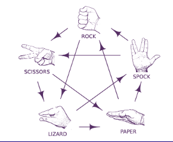

# Rock, Paper, Scissors, Lizard, Spock

The RPSLS game website utilises Javascript to provide an interactive game of Rock, Paper, Scissors, Lizard, Spock for users and incorporates full instructions to learn the rules. Users can opt to play Best of 3, Best of Five or Continuous play.

## Features 

### Existing Features

- __The Landing Page__

  - The landing page gives a clear idea of the purpose of the site. With the title indicating the name of the game.
  - On larger screens there are images representing the 5 main options and for those who dont know how to play an option to view the rules.
  - There are multiple optionsd for game play. Best of 3, Best of 5 and continuous play.

- __Best of 3 page__

  - The Best of 3 page allows the user to play against the computer (first to two wins!).
  - It encorporates a image of the rules initially for both the user and computer and changes depending on both the user choice and computer choice.
  - Choices are made by clicking on the representative image in the Make your Choice section!
  - The current scores are kept in the game section.
  - A home button is encorporated at the bottom of the page. 

- __Best of 3 page - Game Play Section__

  - This section gives a visual representation of the user choice and the computer choice.
  - The score is tracked below the user choice and computer choice. This is updated immediately on the user choosing a move and the computer making its move.
  - When either the user or computer scores 2, the end of game alert appears notifying the user if they won overall or lost. Once cleared the page refreshes, clears the scores and allows the user to play again. 

- __Best of 5 page__

  - The Best of 5 page allows the user to play against the computer (first to three wins!).
  - It encorporates a image of the rules initially for both the user and computer and changes depending on both the user choice and computer choice.
  - Choices are made by clicking on the representative image in the Make your Choice section!
  - The current scores are kept in the game section.
  - A home button is encorporated at the bottom of the page.

- __Best of 5 page - Game Play Section__

  - This section gives a visual representation of the user choice and the computer choice.
  - The score is tracked below the user choice and computer choice. This is updated immediately on the user choosing a move and the computer making its move.
  - When either the user or computer scores 3, the end of game alert appears notifying the user if they won overall or lost. Once cleared the page refreshes, clears the scores and allows the user to play again. 

- __Continuous Play page__

  - The Continuous Play page allows the user to play against the computer continuously.
  - It encorporates a image of the rules initially for both the user and computer and changes depending on both the user choice and computer choice.
  - Choices are made by clicking on the representative image in the Make your Choice section!
  - The current scores are kept in the game section.
  - A home button is encorporated at the bottom of the page.

- __Continuous Play page - Game Play Section__

  - This section gives a visual representation of the user choice and the computer choice.
  - The score is tracked below the user choice and computer choice. This is updated immediately on the user choosing a move and the computer making its move.
  - This can go on for as long as the user wishes

- __Rules Page__

  - This page allows the user to read the rules of the game.
  - The page encorporates a large visual representation of the rules as well as a written list.
  - Once the user is happy with the rules they can choose to play one of the three game modes from link buttons below.
  - A home button is encorporated at the bottom of the page.

- __Rules Page - Rules Section__

  - This section has a visual representation of the rules allows the user to read the rules of the game.
  - There is also a written list of the rules.

- __Rules Page - Rules Section__

  - This section gives the user the option of the three game modes to play
  - There is also a Home button below it should they wish to return to the home page

### Features Left to Implement

- Login section to allow users to save scores.
- Play your friends section. To allow you to play your friends directly using usernames, or play people around the world, chosen at random.

## Testing 

Having published the site, all pages, forms and links have been tested on multiple devices including
- 13" Laptop
- Large Monitor
- iPhone 15
- iPad Air

Using Google Inspect, all pages, forms and links have been tested for multiple different screen sizes including Pixel 7 and a Extra Wide Screen size as well as multiple other random sizes.

Images, videos and text all automatically adjust depending on screen size.

All Elements Shrink and grow to fit with no cropping, up to maximum widths and look good on all screen sizes.

### Validator Testing 

- HTML
  - No errors were returned when passing through the official [W3C validator](https://validator.w3.org/nu/?doc=https%3A%2F%2Fcode-institute-org.github.io%2Flove-running-2.0%2Findex.html)
- CSS
  - No errors were found when passing through the official [(Jigsaw) validator](https://jigsaw.w3.org/css-validator/validator?uri=https%3A%2F%2Fvalidator.w3.org%2Fnu%2F%3Fdoc%3Dhttps%253A%252F%252Fcode-institute-org.github.io%252Flove-running-2.0%252Findex.html&profile=css3svg&usermedium=all&warning=1&vextwarning=&lang=en#css)
- JavaScript
  - 
- Colour Contrast
  - Rated as 15.3:1 Contrast ratio using [Adobe Colour Contrast Analyser](https://color.adobe.com/create/color-contrast-analyzer)
- Lighthouse
  - Home Page
    - Scored 90 for Performance due to images and formats. Investigated and decided not to improve on this for now.
    - Scored 100 for Accessibilty.
    - Scored 100 for Best Practices.
  - Best of 3, Best of 5, Continuous Play pages
    - Scored 89 for Performance due to images and formats. Investigated and decided not to improve on this for now.
    - Scored 100 for Accessibilty.
    - Scored 96 for Best Practices, due to a low resolution image.
  - Rules Page
    - Scored 89 for Performance due to images and formats. Investigated and decided not to improve on this for now.
    - Scored 96 for Accessibilty due to headings not being in descending order. The heading is h1 and headings are h3. So though sequential there is no h2, this is due to design.
    - Scored 100 for Best Practices.

### Unfixed Bugs

None at present.

## Deployment

- The site was deployed to GitHub pages. The steps to deploy are as follows: 
  - GitHub repository created using the UI.
  - Site was created using the Visual Studio Code program and linked to the GitHub repository.
  - Changes were committed and synchronised to the Github Repository.
  - Went to the GitHub online UI, Repository>>Settings>>Pages
  - From the source section drop-down menu, the main branch and the root directory were selected and saved.
  - GitHub then created the site and a detailed ribbon display to indicate the successful deployment was displayed.

The live link can be found here - https://gregp1985.github.io/rock-paper-scissors-lizard-spock/index.html

## Credits 

### Content 

- The README was templated from the [LoveRunning README Template](https://github.com/Code-Institute-Solutions/readme-template/blob/master/README.md)
- Fonts 'Happy Monkey' and 'Permanent Marker' were imported through [Google Fonts](https://fonts.google.com/)
- The CSS code for the buttons was taken from [Get CSS Scan](https://getcssscan.com/css-buttons-examples)

### Media

- The picture of the game rules was taken from [Puzzle Wocky](https://puzzlewocky.com/parlor-games/rock-paper-scissors-lizard-spock/)
- The picture of the visual representation of the game options was taken from [Chasing the Frog](http://www.chasingthefrog.com/item/rock-paper-scissors-lizard-spock-t-shirt/)
- The favicons used were generated by [Favicon](https://www.favicon.io)
- The icons in the footer were taken from [Font Awesome](https://fontawesome.com/)
